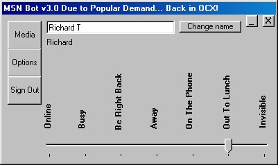

<div align="center">

## MSN Messenger Hotmail Bot


</div>

### Description

37 fully functional functions for using MSN messenger remotly, v3.0 now, and due to popular demand it is now BACK IN A CONTROL! I would put a list of them here... but i cant really be botherd!!!!!!! you can find me on it @ Richard2000uk@Hotmail.com So if you like then add me, as most ppl that do vb on my list get the BETA versions to play with :p,              Oh and thanks to my best friend Kegham for giving me the idea and being the BETA tester and the background function. (Thanks man!)

Please vote :D :) :| :$ :( :'(

lol
 
### More Info
 


<span>             |<span>
---                |---
**Submitted On**   |2002-01-13 16:40:56
**By**             |[Richard Taylor](https://github.com/Planet-Source-Code/PSCIndex/blob/master/ByAuthor/richard-taylor.md)
**Level**          |Beginner
**User Rating**    |3.8 (34 globes from 9 users)
**Compatibility**  |VB 6\.0
**Category**       |[Internet/ HTML](https://github.com/Planet-Source-Code/PSCIndex/blob/master/ByCategory/internet-html__1-34.md)
**World**          |[Visual Basic](https://github.com/Planet-Source-Code/PSCIndex/blob/master/ByWorld/visual-basic.md)
**Archive File**   |[MSN\_Messen484581132002\.zip](https://github.com/Planet-Source-Code/richard-taylor-msn-messenger-hotmail-bot__1-30424/archive/master.zip)

### API Declarations

```
'Some tips for ppl that cant do any controls. (or they think that...
'A control can just be exaclty like a module, Packed full of public functions, thats all they are!!!
'You can do properties and other things but that takes some ActiveX knolage
```


